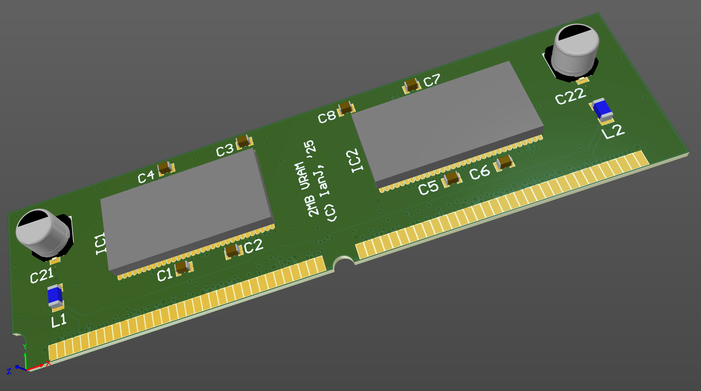

# Acorn RiscPC 1MB/2MB VRAM module (16bit RAMs)

February 2025

This is my implementation of RiscPC 1MB/2MB VRAM module, using 16bit RAMs - concept from Simtec's design.

This is a work in progress - not yet complete and obviously not built/tested.

## Licence

No warranty is provided, and this work is used at your own risk.  

Licenced as CC BY-SA 4.0

Copyright 2025 Ian Jeffray

